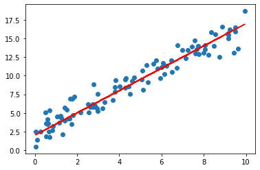
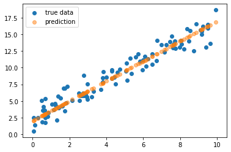

# MindNotes - Deep Learning - Linear Regression

**Author: Christian M.M. Frey**  
**E-Mail: <christianmaxmike@gmail.com>**

---

## PyTorch - Linear Regression
---


In this tutorial we have to solve basic tasks in pytorch and also a linear regression problem using both, an analytical solution as well as iteratively learning a linear regression model. It is recommended to look up the basic learning procedure in pytorch and how the forward methods for learning a model can be used. Let's code!

#### Load dependencies


```python
import torch
import torch.autograd as autograd
import matplotlib.pyplot as plt
import numpy as np
torch.__version__
```


    '1.9.0'


### 1. Recap: Basics

#### a) Create a tensor of shape (2, 5, 5) with random numbers from a standard normal distribution! Print the shape!


```python
t = torch.randn(2,5,5)

print(t.size())
```

    torch.Size([2, 5, 5])


#### b) Create a tensor with floats from the following matrix


```python
M = [[1, 2, 3], [4, 5, 6]]
```


```python
M_tensor = torch.FloatTensor(M)
print(M_tensor)
```

    tensor([[1., 2., 3.],
            [4., 5., 6.]])


#### c) Get the 2nd column and the 1st row of the tensor matrix created in b) respectively


```python
print(M_tensor[:, 1])
print(M_tensor[0, :])
```

    tensor([2., 5.])
    tensor([1., 2., 3.])


#### d) Reshape the following tensor to become two dimensional with shape = (9, 3) and get the mean per column


```python
x = torch.randn(3, 3, 3)
print(x)
```

    tensor([[[ 2.1519,  1.4420, -0.2922],
             [ 0.7861, -0.2995, -0.2915],
             [-1.9797, -0.4868,  0.4467]],
    
            [[-0.9134, -0.9735,  0.8034],
             [ 0.8848, -0.5493, -1.3184],
             [-0.7388, -2.3136,  1.0428]],
    
            [[-0.4044,  0.7170, -0.6831],
             [ 1.9426, -0.1602, -1.6435],
             [ 0.2225,  0.2656,  0.2089]]])


```python
x_reshaped = x.view(9, 3)
print(x_reshaped)
print(x_reshaped.mean(dim=0))
```

    tensor([[ 2.1519,  1.4420, -0.2922],
            [ 0.7861, -0.2995, -0.2915],
            [-1.9797, -0.4868,  0.4467],
            [-0.9134, -0.9735,  0.8034],
            [ 0.8848, -0.5493, -1.3184],
            [-0.7388, -2.3136,  1.0428],
            [-0.4044,  0.7170, -0.6831],
            [ 1.9426, -0.1602, -1.6435],
            [ 0.2225,  0.2656,  0.2089]])
    tensor([ 0.2169, -0.2620, -0.1919])


#### e) Convert the following tensor into a numpy tensor


```python
t = torch.ones(10)
print(t)
```

    tensor([1., 1., 1., 1., 1., 1., 1., 1., 1., 1.])


```python
n = t.numpy()
print(n)
```

    [1. 1. 1. 1. 1. 1. 1. 1. 1. 1.]


### 2. Gradients with PyTorch

#### In the following cell, get the gradients of s with respect to x and y respectively. Play around with other functions/gradients


```python
#calculate gradients
x = torch.tensor([1., 2., 3.]).requires_grad_()
y = torch.tensor([4., 5., 6.]).requires_grad_()
z = 2*x + y**2
s = z.sum()
print(z.grad_fn)
print(s.grad_fn)
```

    <AddBackward0 object at 0x7fae06da5400>
    <SumBackward0 object at 0x7fae06da59e8>


```python
s.backward() 
print("ds/dx\n", x.grad)
print("ds/dy\n", y.grad)

#Be careful: by default, gradients accumulate everytime you call them! Thus, call:
x.grad.zero_()
y.grad.zero_()
```

    ds/dx
     tensor([2., 2., 2.])
    ds/dy
     tensor([ 8., 10., 12.])


    tensor([0., 0., 0.])


### 3. Simple Linear Regression

#### a) Solve the following linear regression problem analytically.  Compare the result for different values of n!


```python
torch.manual_seed(3)

n = 100
d = 1
x = torch.FloatTensor(n, d).uniform_(0, 10)
noise = torch.FloatTensor(n, d).normal_(0, 1)

t = 2    #intercept 
m = 1.5  #slope


y = m*x + t + noise
r = m*x + t #regression line, just for plotting

plt.scatter(x, y)
plt.plot(x.numpy(), r.numpy(), 'r')
plt.show()
```





```python
m_pred = ((x - x.mean()) * (y - y.mean())).sum()/ ((x - x.mean())**2).sum() #slope
t_pred = y.mean() - m* x.mean() #intercept
print("Y = {:.2f}*x + {:.2f}".format(m_pred, t_pred))
```

    Y = 1.43*x + 2.11


#### b) Fill in the missing parts of the LinearRegression model below.
The forward method should just return a linear function of x. <br>
Train the model to learn the parameters above! <br> See what happens for different learning rates!


```python
import torch.nn as nn
import math
```


```python
#calculate minimal possible MSE loss
y_perfect = m*x + t #without noise
nn.MSELoss()(y, y_perfect)  # => as threshold for training
```


    tensor(1.2995)


```python
class LinearRegression(nn.Module):

    def __init__(self, in_dim, out_dim):

        super(LinearRegression, self).__init__() 
        # Calling Super Class's constructor
        self.linear = nn.Linear(in_dim, out_dim)

    def forward(self, x):
        out = self.linear(x)  # Here the forward pass is simply a linear function
        return out

IN_DIM = 1
OUT_DIM = 1

#1. Create instance of model 
model = LinearRegression(IN_DIM, OUT_DIM)

#2. Define Loss
loss_function = nn.MSELoss() # Mean Squared Error

#3. Setup Training
alpha = 0.02 #learning rate
optimizer = torch.optim.SGD(model.parameters(), lr=alpha)

#4. Train the model
MAX_EPOCHS = 500
THRESHOLD = 1.3

for epoch in range(MAX_EPOCHS):
    optimizer.zero_grad() #clear gradients
    y_pred = model(x)  #run model.forward() to get our prediction
    loss = loss_function(y_pred, y)
    loss.backward()     #back propagation
    optimizer.step()    #update parameters
    if epoch%10==0:
        print('epoch {}, loss {}'.format(epoch,loss.data))
    if loss.data < 1.3:
        break;
```

    epoch 0, loss 90.17665100097656
    epoch 10, loss 2.5911574363708496
    epoch 20, loss 2.3015341758728027
    epoch 30, loss 2.0744073390960693
    epoch 40, loss 1.8962912559509277
    epoch 50, loss 1.7566097974777222
    epoch 60, loss 1.647068977355957
    epoch 70, loss 1.5611660480499268
    epoch 80, loss 1.4937993288040161
    epoch 90, loss 1.4409695863723755
    epoch 100, loss 1.3995394706726074
    epoch 110, loss 1.3670496940612793
    epoch 120, loss 1.3415703773498535
    epoch 130, loss 1.3215889930725098
    epoch 140, loss 1.3059196472167969


#### c) Print the learned parameters


```python
for param in model.parameters():
    print(param.data)

    #or: 
#print(model.linear.weight, model.linear.bias)
```

    tensor([[1.4959]])
    tensor([2.0031])


#### d) Apply the trained model to x and plot the predictions along with the true values in a scatter plot


```python
print(model.linear.weight, model.linear.bias)
with torch.no_grad():
    predictions = model(x)
    plt.scatter(x, y, label = 'true data')
    plt.scatter(x, predictions, label = 'prediction', alpha = .5)
    plt.legend()
    plt.show()
```

    Parameter containing:
    tensor([[1.4959]], requires_grad=True) Parameter containing:
    tensor([2.0031], requires_grad=True)





# End of this MindNote
