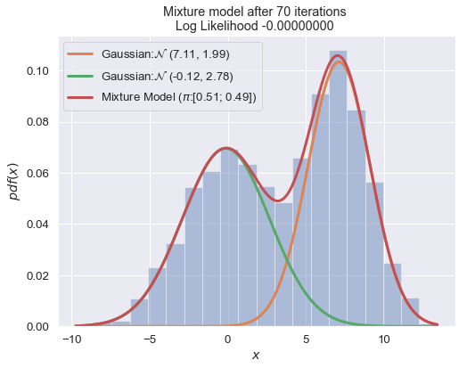
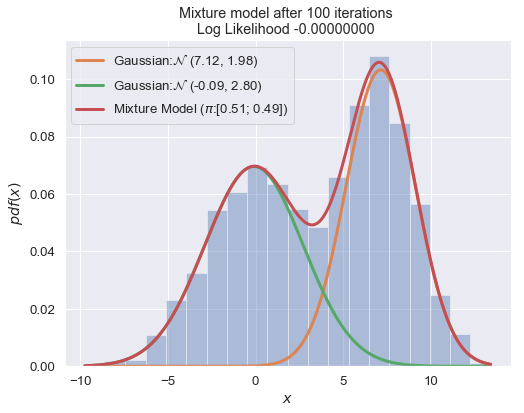

# MindNote - Machine Learning - Unsupervised Learning - Clustering

**Author: Christian M.M. Frey**  
**E-Mail: <christianmaxmike@gmail.com>**

---

## Mixture Model w/ 2 Gaussians
---

In general, in a gaussian mixture model each base distribution in the mixture is multivariate gaussian with mean $\mu_k$ and covariance matrix $\Sigma_k$. Thus, the complete model has the form:
$$
p(x_i | \theta) = \sum_{k=1}^{K} \pi_k \mathcal{N}(x_i | \mu_k, \Sigma_k)
$$

In this tutorial we want to have an insight in the gaussian mixture model when using 2 gaussians $\mathcal{N}(\mu_1, \sigma_1^2)$ and $\mathcal{N}(\mu_2, \sigma_2^2)$. Hence, we need to estimate 5 parameters $\theta=(\boldsymbol{\pi}, \mu_1, \sigma_1^2, \mu_2, \sigma_2^2)$, where $\pi_1$ is the probability that the data $x$ comes from $\mathcal{N}(\mu_1, \sigma_1^2)$ and $\pi_2 = 1-\pi_1$ is the probability that the data was generated by $\mathcal{N}(\mu_2, \sigma_2^2)$. Therefore, the probability density function (PDF) of the mixture model is given by:

$$
f(x | \theta) = \pi_1 f_1(x | \mu_1, \sigma_1^2) + \pi_2 f_2(x | \mu_2, \sigma_2^2)
$$


#### Load dependencies


```python
import matplotlib.pyplot as plt
import matplotlib as mpl
import seaborn as sns
sns.set()
%matplotlib inline
import numpy as np
from scipy import stats
import pandas as pd
from math import sqrt,log,exp,pi

mpl.rcParams['axes.titlesize'] = "large"
sns.set_context("notebook", font_scale=1.2)
```

#### Generate data


```python
np.random.seed(42)

# params for the first gaussian
mu_1 = 0
sigma_1 = 3

# params for the second gaussian
mu_2 = 7
sigma_2 = 2

# data generated from N(mu_1, sigma_1^2) and N(mu_2, sigma_2^2)
y_1 = np.random.normal(mu_1, sigma_1, 1000)
y_2 = np.random.normal(mu_2, sigma_2, 1000)

# concat data
data = np.concatenate((y_1, y_2))

# subdivide space 
x = np.linspace(min(data), max(data), 2000)

# plot data
sns.distplot(data, bins=50, kde=False)
plt.title("Visualizing the data distribution")
```


    <matplotlib.text.Text at 0x1141e92b0>


Next, we will implement a class representing an univariate guassian. The probability density function of a gaussian is given by:
$$
f(x; \mu, \sigma^2)\frac{1}{\sqrt{2 \pi \sigma^2}} \cdot e^{- \frac{(x - \mu)^2}{2 \sigma^2}}
$$


```python
class Gaussian (object):
    """
    Class for an univariate gaussian
    
    Arguments:
      mu: mean of the gaussian
      sigma: standard deviation of the gaussian
    
    Properties:
      mu: mean of the gaussian 
    """
    
    def __init__(self, mu, sigma):
        self.mu = mu
        self.sigma = sigma
        
    def pdf(self, x):
        """
        Calculates the probability density function of the gaussian
        
        Arguments:
          x : pdf is calculated for falling within the infitesimal
            interval [x, x + dx]
            
        Returns:
          pdf(x) - probability density function evaluated for x being
            attached as parameter
        """
        return (1/sqrt(2 * pi * self.sigma**2)) * exp( - (x-self.mu)**2 / (2 * self.sigma**2))
    
    def __str__(self):
        """
        Textual representation of the gaussian
        
        Returns:
          string representation of the object
        """
        return "N ({0:.2f}, {1:.2f})".format(self.mu, self.sigma)
```

#### Fit the data with 1 gaussian


```python
g_1 = Gaussian(np.mean(data), np.std(data))
print (g_1)
```

    N (3.60, 4.34)


```python
# iterate values in 'x' and calculate the pdf values for each x_i
g_1_pdfs = []
for x_i in x:
    g_1_pdfs.append(g_1.pdf(x_i))
sns.distplot(data, bins=20, kde=False, norm_hist=True)
plt.plot(x, g_1_pdfs)
plt.legend()
```

    /Users/ChrisMaxMike/anaconda/lib/python3.6/site-packages/matplotlib/axes/_axes.py:545: UserWarning: No labelled objects found. Use label='...' kwarg on individual plots.
      warnings.warn("No labelled objects found. "


### EM for GMMs
We will no discuss how to fit a mixture of Gaussians using EM. We assume the number of mixture components, $K$, is known.

#### The Estimation step:
The E Step has the following simple form, which is the same for any mixture model:
$$
r_{ik} = \frac{\pi_k p(x_i | \theta_k^{(t-1)})}{\sum_{k'} \pi_{n'} p (x_i | \theta_{k'}^{(t-1)})}
$$

where $r_{ik} \triangleq p(z_i = k \|x_i, \theta^{(t-1)})$ is the $\textbf{responsibility}$ that cluster $k$ takes for data point $i$.

#### The M step:
In the M step, we optimize the log likelihood wrt $\pi$ and the $\theta_k$.
For $\pi$, we have:
$$
\pi_k = \frac{1}{N} \sum_{i} r_{ik} = \frac{N_k}{N}
$$

where $N_k \triangleq \sum_{i} r_{ik}$ is the weighted number of points assigned to cluster $k$.

$$
\mu_k^{new} = \frac{1}{N_k}\sum_{n=1}^{N} r_{ik}x_n
$$

$$
\Sigma_{k}^{new} = \frac{1}{N_k}\sum_{n=1}^{N}r_{ik} (x_n - \mu_k^{new})(x_n - \mu_{k}^{new})^T
$$

In the last step we evaluate the log likelihood and check for convergence of either the parameters or the log likelihood. If the convergence criterion is not satisfied, we continue with the E-step.

$$
ln \; p(X|\mu, \Sigma, \pi) = \sum_{n=1}^{N}ln \{\sum_{k=1}^{K} \pi_k \mathcal{N}(x_n | \mu_k, \Sigma_k)\}
$$


```python
class GaussianMixture(object):
    """ Class for modeling a gaussian mixture model w/ 2 gaussians
    
    Arguments:
      data: input data
      pi_1: weight for the first gaussian distribution (pi_2 will be 1-pi_1)
      seed: random seed
    
    Properties:
      data: data used for the mixture model
      g1: first gaussian model
      g2: second gaussian model
      pi_1: weight for the first gaussian model g1
      pi_2: weight for the second gaussian model g2
      loglike: log-likelihood of the distribution
    """
    
    def __init__ (self, data, pi_1 = .5, seed=42):
        self.data = data
        
        np.random.seed(seed)
        self.g1 = Gaussian(np.random.uniform(min(data), max(data)), 1)
        self.g2 = Gaussian(np.random.uniform(min(data), max(data)), 1)
        self.pi_1 = pi_1
        self.pi_2 = (1-pi_1)
        
    def EStep(self):
        """
        performs the estimation step of the EM algorithm. 
        Assigns each point to the mixture model with a precentage.
        """
        self.loglike = 0
        
        for d in self.data:
            w1 = self.g1.pdf(d) * self.pi_1
            w2 = self.g2.pdf(d) * self.pi_2
            
            denominator = w1 + w2
            
            w1 /= denominator
            w2 /= denominator
            
            self.loglike += log (w1+w2)
            
            yield (w1, w2)
            
    def MStep(self, weights):
        """
        performs an maximization-step
        """
        
        (left, right) = zip(*weights)
        g1_d = sum(left)
        g2_d = sum(right)
        
        # mu new
        self.g1.mu = sum(w * d for (w, d) in zip(left, data)) / g1_d
        self.g2.mu = sum(w * d for (w, d) in zip(right, data)) / g2_d
                          
        # compute new sigmas 
        self.g1.sigma = sqrt(sum(w * ((d - self.g1.mu) **2) for (w,d) in zip(left, data)) / g1_d)
        self.g2.sigma = sqrt(sum(w * ((d - self.g2.mu) **2) for (w,d) in zip(right, data)) / g2_d)
        
        # compute new weights
        self.pi_1 = g1_d / len(data)
        self.pi_2 = g2_d / len(data)
        
    def _calculate_loglike(self):
        """
        calculates the log likelihood of the model; the calculation is performes the same as in the
        E step
        """
        self.EStep()
        
    def evaluate(self):
        """
        performs an iteration of of the EM algorithm
        """
        self.MStep(self.EStep())    
        self._calculate_loglike()
                          
    def pdf(self, x):
        """
        Computes the probability density function for this gaussian
        mixture model.
        
        Arguments:
          x : data for which the pdf is calculated
          
        Returns:
          pdf(x) - probability density function evaluated for the input
            data x being attached as parameter
        """
        return (self.pi_1)* self.g1.pdf(x) + (self.pi_2)*self.g2.pdf(x)
    
    def __str__(self):
        return ("=== \n Gaussian Mixture Model: \n " +
        "\t {pi1:.2f} of Gaussian: {g1} \n".format(pi1=self.pi_1, g1=self.g1) +
        "\t {pi2:.2f} of Gaussian: {g2} \n".format(pi2=self.pi_2, g2=self.g2) + 
        "===")
```


```python
def plot_mixture_model(data, x, mixture_model, title=""):
    """
    method for plotting the mixture model consisting of 2 gaussians
    
    Arguments:
      data: input data being used for the mixture model
      x: equal linespaced values used for computing the values of the gaussian models
      mixture_model: mixture model having been computed
      title: title of the plot
    """
    plt.figure(figsize=(8,6))
    plt.title(title)
    plt.xlabel("$x$")
    plt.ylabel("$pdf(x)$")
    
    # plot data
    sns.distplot(data, bins=20, kde=False, norm_hist=True)
    
    # plot first gaussian model
    g1 = [mixture_model.g1.pdf(x_i) * mixture_model.pi_1 for x_i in x]
    plt.plot(x, g1, linewidth=3, label='Gaussian:{}'.format(str(mixture_model.g1).replace("N", r"$\mathcal{N}$")));
    
    # plot second gaussian model
    g2 = [mixture_model.g2.pdf(e) * mixture_model.pi_2 for e in x]
    plt.plot(x, g2, linewidth=3, label='Gaussian:{}'.format(str(mixture_model.g2).replace("N", r"$\mathcal{N}$")));

    #plot mixturem model
    gmm_vals = [mixture_model.pdf(x_i) for x_i in x]
    plt.plot(x, gmm_vals, linewidth=3, label='Mixture Model ($\pi$:[{0:4.2}; {1:4.2}])'.format(mixture_model.pi_1, mixture_model.pi_2));

    # show legend
    plt.legend();
```


```python
n_iter = 100
best_mixture_model = None
best_loglike = float('-inf')
mixture_model = GaussianMixture(data, seed=66)

for i in range(1, n_iter+1):
    mixture_model.evaluate()
    if i % 10 == 0:
        plot_mixture_model(data, x, best_mixture_model, title="Mixture model after {i} iterations \nLog Likelihood {log:.8f} ".format(i=i, log=best_mixture_model.loglike))
    if mixture_model.loglike > best_loglike:
        best_loglike = mixture_model.loglike
        best_mixture_model = mixture_model
```








```python
print (best_mixture_model)
```

    === 
     Gaussian Mixture Model: 
     	 0.51 of Gaussian: N (7.12, 1.98) 
    	 0.49 of Gaussian: N (-0.09, 2.80) 
    ===


# End of this MindNote
