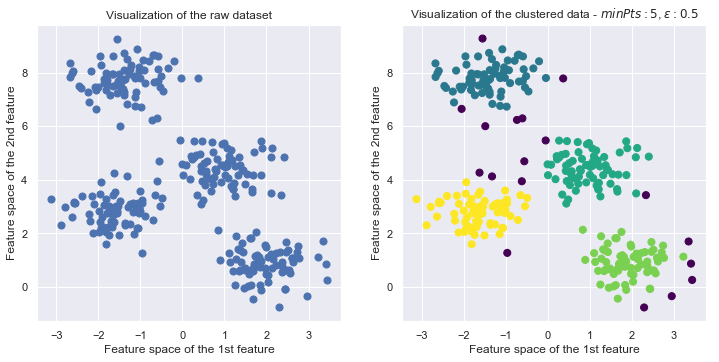
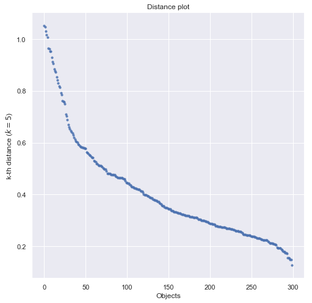
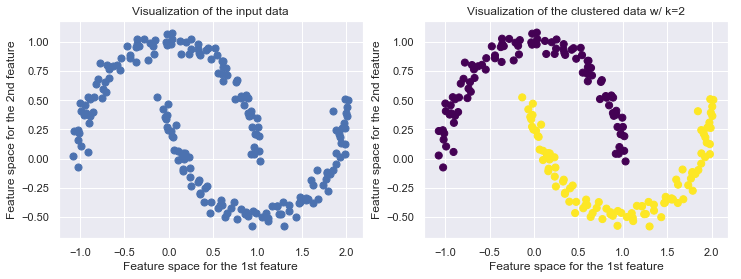

# MindNote - Machine Learning - Unsupervised Learning - Clustering

**Author: Christian M.M. Frey**  
**E-Mail: <frey@dbs.ifi.lmu.de>**

---

## DBSCAN
---


DBSCAN (Density Based Spatial Clustering of Applications with Noise) is designed to discover clusters and noise in a spatial database. It has been published at the KDD'96 and is amongst the density-based clustering algorithms probably the most popular one. 

A naive approach could require for each point in a cluster that there are at least a minimum number $minPts$ of points in an $Eps-neighboorhood$ of that point. This approach fails because there are two kinds of points in a cluster, points inside the cluster (core points) and points on the border of the cluster (border points). Generally, an $Eps$-neighboorhood of a border point contains significantly less points than an $Eps$-neighboorhood of a core point.

> <dl>
    <dt><b>Definition 1</b>: (Eps-neighborhood of a point).</dt> 
    <dd>The Eps-neighborhood of a point p, denoted by $N_{Eps}(p)$ is defined by 
        $$ 
        N_{Eps} \;(p) = \{q \in D \| dist(p,q) \leq Eps\} 
        $$
     </dd>
  </dl>

As this value would be hard to set for each point in a cluster and this low value would not be characteristic for a cluster - esp. in the presence of noise - it is required that for every point $p$ in a cluster $C$ there is a point $q \in C$ so that $p$ is inside of the $Eps$-neighboorhood of $q$ and $N_{Eps}(q)$ contains at least $MinPts$ points. This give rise to the following defintion:

> <dl>
    <dt><b>Definition 2</b>: (directly density-reachable). </dt>
    <dd>A point $p$ is directly density-reachable from a point $q$ w.r.t $eps$, minPts if two conditions hold:
        * $p \in N_{Eps}(q)$
        * $\| N_{Eps}(q)\| \geq MinPts$ (core point condition)
    </dd>
  </dl>

Directly density-reachable is symmetric for pairs of core points. In general, however, it is not symmetric if one core point and one border point are involved. 

> <dl>
    <dt><b>Definition 3</b>: (density-reachable).</dt>
    <dd>A point $p$ is density-reachable from a point $q$ w.r.t $Eps$ and $MinPts$ if there is a chain of point $p_1, \ldots, p_n$, $p_1 = q$, $p_n = p$ such that $p_{i+1}$ is directly density-reachable from $p_i$.
    </dd>
  </dl>

Density-reachability is a canonical extension of direct density-reachability. This relation is transitive, but it is not symmetric. 

Two border points of the same cluster $C$ are possibly not density reachable from each other because the core point condition might not hold for both of them. However, there must be a core point in $C$ from which both border points of $C$ are density-reachable. Therefore, the authors introduced the notion of density-connectivity covering the relation of border points.

> <dl>
    <dt><b>Defintion 4</b>: (density-connected).</dt>
    <dd>A point $p$ is density-connected to a point $q$ w.r.t $Eps$ and $MinPts$ if there is a point $o$ such that both, $p$ and $q$ are density-reachable from $o$ w.r.t $Eps$ and $MinPts$.
    </dd>
  </dl>

Hence, the density-connectivity is a symmetric relation. 

The pseudocode of the original sequential DBSCAN Algorithm is given by:

```python
Input: DB, ε, minPts, dist_fnc, labels
1 foreach point p in database DB do
2     if label(p) 􏰀!= undefined then continue
3     Neighbors N ←RangeQuery(DB,dist,p,ε)
4     if |N| < minPts then
5         label(p) ← Noise
6         continue
7     c ← next cluster label
8     label(p) ← c
9     Seed set S ← N \ {p}
10    foreach q in S do
11        if label(q) = Noise then label(q) ← c
12        if label(q) !=􏰀 undefined then continue
13        Neighbors N ← RangeQuery(DB, dist, q, ε)
14        label(q)←c
15        if |N| < minPts then continue
16        S←S u N
```

#### Load dependencies


```python
import scipy as scipy
import matplotlib.pyplot as plt
import numpy as np
import seaborn as sns
sns.set()
```

#### Implementation of DBSCAN


```python
class DBSCAN(object):
    '''
    This class implements the density based spatial clustering in applications with noise algorithm
    
    Arguments:
      eps: epsilon being used to identify the eps-neighborhood of a datapoi t
      min_pts: minimal number of points s.t. a datapoint can be considered as a core object if the number
        of points in the eps-neighborhood exceeds min_pts
      dist_method: distance function being used to calculate the proximity of two datapoints
      
    Properties:
      eps: epsilon value for the eps-neighborhood
      min_pts: minimal number of points for identifying core objects
      dist_method: distance fnc
      labels: labels of the datapoints, i.e., the affiliation of the points to the clusters
    '''
    
    def __init__(self, eps, min_pts, dist_method='euclidean'):
        self.eps = eps
        self.min_pts = min_pts
        self.dist_method = dist_method
        self.labels = None
        
    def fit(self, data):
        '''
        This method executes the DBSCAN algorithm on the attached 
        dataset. First, it calculates the distances for each point
        within the dataset to each other point. By iterating the whole
        dataset, we can identify the affiliation for the points to 
        clusters. Hence, if we have found a core point, the point
        is used to expand the cluster, i.e., by calling the subrouting
        _expand_cluster(.), we can identfy each point being density
        reachable from a core point. If for an datapoint the conditions
        for a core point do not hold, we can regard this point as a 
        Noise point (probably border point). After the cluster expansion,
        we take the next unlabeled point and continue in the same manner
        as described till every point is labeled. 
        
        Arguments:
          data: the dataset
        '''
        m, dim = data.shape
        dist_mx = scipy.spatial.distance.squareform(scipy.spatial.distance.pdist(data))
        self.labels = np.full(m, np.nan)
        cluster_idx = 0
        for i in range(m):
            if not np.isnan(self.labels[i]): continue
            neighbors = np.where(dist_mx[i] < self.eps)[0]
            if len(neighbors) < self.min_pts:
                self.labels[i] = -1 # Noise
                continue
            cluster_idx += 1
            self.labels[i] = cluster_idx
            seed = neighbors
            seed_set = seed.tolist()
            
            self._expand_cluster(i, seed_set, cluster_idx, dist_mx)
            
    def _expand_cluster(self, point, seed_set, cluster_idx, dist_mx):
        '''
        This method is used to aggregate all points being density
        reachable by the datapoint being attached as parameter ('point').
        All point which have been marked to be NOISE may be changed, if 
        they are density-reachable from some other point within the cluster.
        This happens for border points of a cluster. 
        
        Arguments:
          point: the datapoint from which on we expand the cluster
          seed_set: a set containing all points being density reachable
            within the cluster being currently regarded
          cluster_idx: the id of the current cluster
          dist_mx: a distance matrix NxN containing the proximity for 
            each point in the dataset to each other point 
        '''
        for s in seed_set:
            if np.isnan(self.labels[s]) or self.labels[s] == -1:
                neighbors = np.where(dist_mx[s] < self.eps)[0]
                self.labels[s] = cluster_idx
                if len(neighbors) < self.min_pts:
                    continue
                for j in neighbors:
                    try:
                        seed_set.index(j)
                    except ValueError:
                        seed_set.append(j)
```

#### Generate dataset


```python
from sklearn.datasets.samples_generator import make_blobs
X, y_true = make_blobs(n_samples=300, centers=4, cluster_std=0.60, random_state=0)
```

#### Run it!


```python
dbscan = DBSCAN(0.5, 5)
dbscan.fit(X)
```

#### Plot the Clustering


```python
fig = plt.figure(figsize=(12,12))
ax1 = fig.add_subplot(2,2,1) #row, column, figure number
ax2 = fig.add_subplot(2,2,2)

ax1.scatter(X[:, 0], X[:, 1], s=50)
ax1.set_title("Visualization of the raw dataset")
ax1.set_xlabel("Feature space of the 1st feature")
ax1.set_ylabel("Feature space of the 2nd feature")

ax2.scatter(X[:, 0], X[:, 1], c=dbscan.labels, s=50,  cmap='viridis')
ax2.set_title("Visualization of the clustered data - $minPts:{minPts}$, $\epsilon:{eps}$".format(minPts=dbscan.min_pts, eps=dbscan.eps))
ax2.set_xlabel("Feature space of the 1st feature")
ax2.set_ylabel("Feature space of the 2nd feature")
```


    <matplotlib.text.Text at 0x119c77630>





#### Usage in sklearn


```python
from sklearn.cluster import DBSCAN as sklearn_dbscan

dbscan_sklearn = sklearn_dbscan(min_samples=5, eps=.5)
dbscan_sklearn.fit(X)
```


    DBSCAN(algorithm='auto', eps=0.5, leaf_size=30, metric='euclidean',
        metric_params=None, min_samples=5, n_jobs=1, p=None)


#### Determining the parameters s $minPts$ and $\epsilon$

An effective heuristic is to determine the params $Eps$ and $minPts$ by the cluster being the most sparse. 
For a given $k$, a mapping function is used indicating for each point the distance to the $k$-th nearest neighbor. When sorting the points of the database in descending order w.r.t their $k$-dist values, the graph yields information concering the density distribution in the databse. We call this graph the $sorted k-dist graph$. 
Considering any point $p$, the parameter $Eps$ to the $k-dist(p)$ and the parameter $MinPts$ to $k$. Consequently, all points with an equal or smaller $k-dist$ values will be core points. If there's a threshold point (a 'kink') with the maximal $k-dist$ value in the cluster being the most sparse, we find a good choice for the desired parameters. All points with a higher $k-dist$ value are the considered to be noise, all other points are assigned to some cluster. 


```python
def draw_distance_plot(X, knn):
    '''
    Plots the 'sorted k-dist graph' w.r.t the dataset X and the k-th
    nearest neighbor for each datapoint x in X.
    
    Arguments:
      X: the dataset
      knn: parameter k being used for identifying the k-th nearest 
        neighbor.
    '''
    assert knn < len(X)
    
    # Calcualting the k-th nearest neighbors
    dist_mx = scipy.spatial.distance.squareform(scipy.spatial.distance.pdist(X))
    k_nearest_neighs = [np.sort(dist_mx[idx], axis=0)[knn + 1] for idx in range(dist_mx.shape[0])]
    k_nearest_neighs = sorted(k_nearest_neighs, reverse=True)
    
    # plotting the distance plot
    plt.figure(figsize=(8,8))
    plt.title("Distance plot")
    plt.xlabel("Objects")
    plt.ylabel("k-th distance ($k={}$)".format(knn))
    plt.scatter(range(len(k_nearest_neighs)), k_nearest_neighs, s=10, alpha=.8)
    
draw_distance_plot(X, 5)
```





#### DBSCAN is not limited to linear boundaries


```python
from sklearn.datasets import make_moons
from sklearn.cluster import DBSCAN as sklearndbscan

X_moon, y_moon = make_moons(200, noise=.05, random_state=0)
k = 2
fig, (ax1, ax2) = plt.subplots(1,2, figsize=(12,4))
ax1.scatter(X_moon[:, 0], X_moon[:, 1], s=50);
ax1.set_title('Visualization of the input data')
ax1.set_xlabel('Feature space for the 1st feature')
ax1.set_ylabel('Feature space for the 2nd feature')

dbscan = DBSCAN(.25, 5)
dbscan.fit(X_moon)
ax2.scatter(X_moon[:, 0], X_moon[:, 1], c=dbscan.labels, s=50, cmap='viridis')
ax2.set_title("Visualization of the clustered data w/ k={k}".format(k=k))
ax2.set_xlabel('Feature space for the 1st feature')
ax2.set_ylabel('Feature space for the 2nd feature')
```


    <matplotlib.text.Text at 0x11b34f9b0>





#### Advantages of DBSCAN

* As opposed to the $k-Algorithms$ (k-Means, k-Medoid, k-Median, k-Mode), it is not a requirement for DBSCAN to specify the number of clusters in the data a priori

* With a density clustering approach, we are able to find arbitrarily shaped clusters, i.e., clusters with a more complex shape. 

* DBSCAN has a notion of noise and is robuts against outliers

* The design of DBSCAN allows the use of databases improving region queries , e.g., using an R*-Tree


#### Additional notes
* published in: Ester M., Kriegel H.P., Sander J., Xu X., A Density-Based Algorithm for Discovering Clusters in Large Spatial Databases with Noise", in KDD 1996, pp. 226-331 

# End of this MindNote
