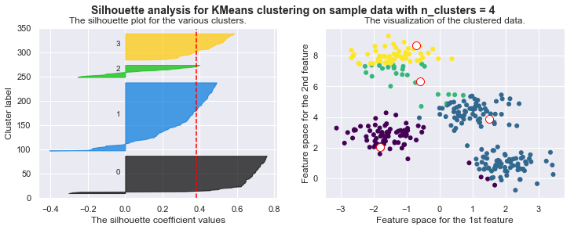
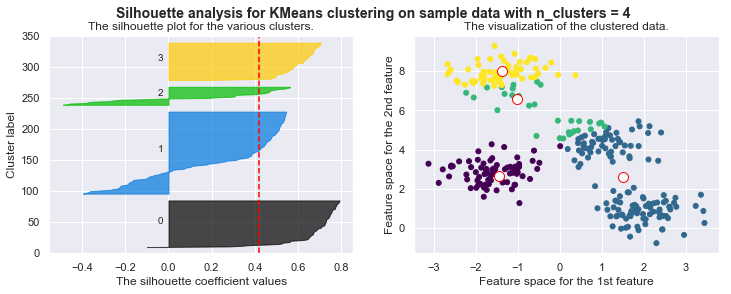
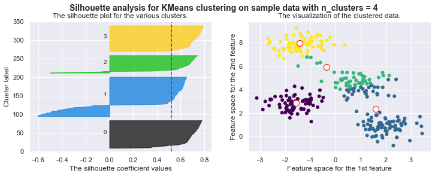
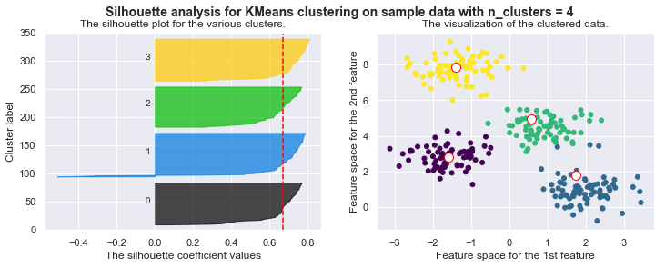
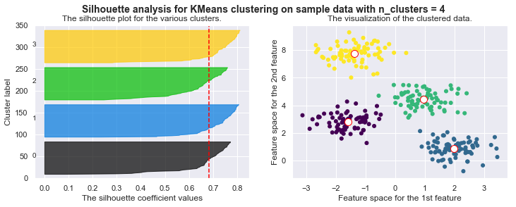
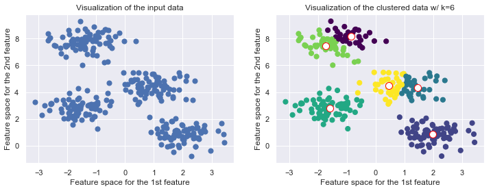

# MindNote - Machine Learning - Unsupervised Learning - Clustering

**Author: Christian M.M. Frey**  
**E-Mail: <christianmaxmike@gmail.com>**

---

## K-Means
---

Idea of the kmeans is that given an input data, we want to find a clustering such that the within-cluster variation of each cluster is small and we use the centrois of a cluster as the representative of them.
Hence, the objective for a given $k$ is to form $k$ groups such that the sum of the (squared) distances between the mean of the groups and their elements is minimal.

The objective function, we try to optimize is defined as:
$$
J = \sum_{i=0}^{k} \sum_{m \in C_i} (m - c_i)^2
$$
where $c_i$ denotes the centroid of the cluster $C_i$.

#### Load dependencies


```python
%matplotlib inline
import matplotlib.pyplot as plt
import seaborn as sns;
import numpy as np
sns.set()
from sklearn.metrics import silhouette_samples, silhouette_score
import math
import matplotlib.cm as cm
```


```python
from sklearn.datasets.samples_generator import make_blobs
X, y_true = make_blobs(n_samples=300, centers=4, cluster_std=0.60, random_state=0)
plt.scatter(X[:, 0], X[:, 1], s=50);
```


#### Implementation of KMeans


```python
class KMeans (object):
    """
    Implementation of the KMeans algorithm
    
    Arguments:
      n_clusters: number of clusters 
      centroids: the centroids describing the cluster representatives
      seed: random seed
      
    Properties: 
      n_clusters: number of clusters
      centroids: centroids being the cluster representatives
      random_gen: random number generator (for initializing the centroids)
      cls_labels: the labels of the datapoints,i.e., indicator to which cluster a point
        is affiliated
    """
    def __init__(self, n_clusters, centroids=None, seed=42):
        self.n_clusters = n_clusters
        self.centroids = centroids
        self.random_gen = np.random.RandomState(seed)
        self.cls_labels = None

    def _euclidean (self, x, y):
        """
        calculates the l2 distance between two vectors
        
        Returns: 
          the l2 distance (euclidean distance)
        """
        return math.sqrt(sum([(a - b) ** 2 for a, b in zip(x, y)]))

    def _pick_random_centroids(self, X):
        """
        method for initializing random centroids. Picks n random points out of the dataset,
        where n is the number of clusters
        
        Returns:
          n number of centroids, where n is the number of clusters 
        """   
        centroids = X[self.random_gen.choice(X.shape[0], self.n_clusters, replace=False), :]
        return centroids
    
    def _plot_clustering(self, X, it):  
        """
        Method for plotting the current clustering. We plot the dataset, the current
        centroids and colors indicate the cluster affiliation
        
        Arguments:
          X: the dataset the algorithm is performed on
          it: the current iteration number 
            (can be used e.g. as an additional information in the title)
        """ 
        plt.figure()
        plt.title("Iteration {d}".format(d=it))
        plt.scatter(X[:, 0], X[:, 1], c=self.cls_labels, s=50, cmap='viridis');
        plt.scatter(self.centroids[:, 0], self.centroids[:, 1], s=100, c='w', edgecolor="red")
        plt.title("The visualization of the clustered data.")
        plt.xlabel("Feature space for the 1st feature")
        plt.ylabel("Feature space for the 2nd feature")
    
    def fit(self, X, max_iteration=100):
        """
        Method used for executing the KMeans algorithm. 
        
        Arguments: 
          X: the dataset
          max_iteration: the maximal number of iterations being performed
        """       
        # Choose random centroids
        self.centroids = self._pick_random_centroids(X)
        iteration = 1    
        while True:

            # Find closest centroid
            self.cls_labels = np.array([np.argmin([self._euclidean(x, c_i) for c_i in self.centroids]) for x in X])

            # calculation of silhouette score
            # silhouette_avg = silhouette_score(X, self.cls_labels)

            # plot clustered data
            self._plot_clustering(X,iteration)

            # Compute new centroids by means of points being assigned to each cluster
            new_centroids = np.array([X[self.cls_labels == i].mean(axis=0) for i in range(self.n_clusters)])

            # Check termination criteria
            if np.all(self.centroids == new_centroids) or iteration > max_iteration:
                break

            # Assign new centroids
            self.centroids = new_centroids
            iteration += 1

    def fit_silhouette(self, X, max_iteration=100):
        """
        Method used for executing the KMeans algorithm. In addition it plots the silhouette coefficients.
        
        Arguments: 
          X: the dataset
          max_iteration: the maximal number of iterations being performed
        """               
        # Choose random centroids
        self.centroids = self._pick_random_centroids(X)
        iteration = 1    
        while True:

            # Find closest centroid
            self.cls_labels = np.array([np.argmin([self._euclidean(x, c_i) for c_i in self.centroids]) for x in X])

            fig, (ax1, ax2) = plt.subplots(1, 2)
            fig.set_size_inches(12, 4)
            ax1.set_ylim([0, len(X) + (self.n_clusters + 1) * 10])
            ax1.set_title("The silhouette plot for the various clusters.")
            ax1.set_xlabel("The silhouette coefficient values")
            ax1.set_ylabel("Cluster label")

            silhouette_avg = silhouette_score(X, self.cls_labels)
            # The vertical line for average silhouette score of all the values
            ax1.axvline(x=silhouette_avg, color="red", linestyle="--")

            print("For n_clusters =", self.n_clusters, "The average silhouette_score is :", silhouette_avg)
            # plt.figure()
            plt.title("$Iteration {d}$".format(d=iteration))
            ax2.scatter(X[:, 0], X[:, 1], c=self.cls_labels, s=25, cmap='viridis');
            ax2.scatter(self.centroids[:, 0], self.centroids[:, 1], s=100, c='w', edgecolor="red")
            ax2.set_title("The visualization of the clustered data.")
            ax2.set_xlabel("Feature space for the 1st feature")
            ax2.set_ylabel("Feature space for the 2nd feature")
            plt.suptitle(("Silhouette analysis for KMeans clustering on sample data "
                  "with n_clusters = %d" % self.n_clusters),
                 fontsize=14, fontweight='bold')
            
            # Compute the silhouette scores for each sample
            sample_silhouette_values = silhouette_samples(X, self.cls_labels)

            y_lower = 10
            for i in range(self.n_clusters):
                # Aggregate the silhouette scores for samples belonging to
                # cluster i, and sort them
                ith_cluster_silhouette_values = sample_silhouette_values[self.cls_labels == i]
                ith_cluster_silhouette_values.sort()

                size_cluster_i = ith_cluster_silhouette_values.shape[0]
                y_upper = y_lower + size_cluster_i

                color = cm.nipy_spectral(float(i) / self.n_clusters)
                ax1.fill_betweenx(np.arange(y_lower, y_upper),
                                  0, ith_cluster_silhouette_values,
                                  facecolor=color, edgecolor=color, alpha=0.7)

                # Label the silhouette plots with their cluster numbers at the middle
                ax1.text(-0.05, y_lower + 0.5 * size_cluster_i, str(i))

                # Compute the new y_lower for next plot
                y_lower = y_upper + 10  # 10 for the 0 samples


            # Compute new centroids by means of points being assigned to each cluster
            new_centroids = np.array([X[self.cls_labels == i].mean(axis=0) for i in range(self.n_clusters)])

            # Check termination criteria
            if np.all(self.centroids == new_centroids) or iteration>max_iteration:
                break

            # Assign new centroids
            self.centroids = new_centroids
            iteration += 1
```

#### Run it!


```python
kmeans = KMeans(n_clusters=4)
kmeans.fit_silhouette(X)
```

    For n_clusters = 4 The average silhouette_score is : 0.38145632079855524
    For n_clusters = 4 The average silhouette_score is : 0.4196365342575672
    For n_clusters = 4 The average silhouette_score is : 0.5224106511612718
    For n_clusters = 4 The average silhouette_score is : 0.6705159431863005
    For n_clusters = 4 The average silhouette_score is : 0.6819938690643478
    For n_clusters = 4 The average silhouette_score is : 0.6819938690643478

















#### Drawbacks of KMeans

#### KMeans is limited to linear boundaries, i.e., clusters are forced to convex space partitions

If the data generating process has a higher complexity, i.e. if the clusters which we expect to be found have a more complicated geometry, then k-means will often be ineffective. The boundaries of clusters having been found by k-means will always be linear (think of Voronoi cell boundaries).

Recap Voronoi Diagram:
For a given set of points $P = \{p\_1, \ldots, p_k\}$, a Voronois diagram partitions the data space into so-called Voronoi cells. The cell of a point $p \in P$ covers all points in the data space for which $p$ is the nearest neighbors among the points from $P$. The Voronoi cells of two neighboring points $p_i, p_j \in P$ are separated by the perpendicular hyperplane between $p_i$ and $p_j$. Vornois cells are intersection of half spaces and thus convex regions. 


```python
from sklearn.datasets import make_moons
from sklearn.cluster import KMeans

X, y = make_moons(200, noise=.05, random_state=0)
k = 2
fig, (ax1, ax2) = plt.subplots(1,2, figsize=(12,4))
ax1.scatter(X[:, 0], X[:, 1], s=50);
ax1.set_title('Visualization of the input data')
ax1.set_xlabel('Feature space for the 1st feature')
ax1.set_ylabel('Feature space for the 2nd feature')

kmeans = KMeans(k, random_state=42)
labels = kmeans.fit_predict(X)
ax2.scatter(X[:, 0], X[:, 1], c=labels, s=50, cmap='viridis')
ax2.scatter(kmeans.cluster_centers_[:, 0], kmeans.cluster_centers_[:, 1], c='w', edgecolor='red', s=100)
ax2.set_title("Visualization of the clustered data w/ k={k}".format(k=k))
ax2.set_xlabel('Feature space for the 1st feature')
ax2.set_ylabel('Feature space for the 2nd feature')
```


    <matplotlib.text.Text at 0x11ad24160>


#### The number of clusters must be predefined
The number of clusters have to be selected beforehand by the user, i.e. k serves as a hyperparameter to tell the algorithm houw many clusters you expect to find. It cannot learn itself the number of clusters from the data. 


```python
from sklearn.datasets.samples_generator import make_blobs
from sklearn.cluster import KMeans

X, y_true = make_blobs(n_samples=300, centers=4, cluster_std=0.60, random_state=0)
k = 6

fig, (ax1, ax2) = plt.subplots(1,2, figsize=(12,4))
ax1.scatter(X[:, 0], X[:, 1], s=50);
ax1.set_title('Visualization of the input data')
ax1.set_xlabel('Feature space for the 1st feature')
ax1.set_ylabel('Feature space for the 2nd feature')

kmeans = KMeans(k, random_state=42)
labels = kmeans.fit_predict(X)
ax2.scatter(X[:, 0], X[:, 1], c=labels, s=50, cmap='viridis')
ax2.scatter(kmeans.cluster_centers_[:, 0], kmeans.cluster_centers_[:, 1], c='w', edgecolor='red', s=100)
ax2.set_title("Visualization of the clustered data w/ k={k}".format(k=k))
ax2.set_xlabel('Feature space for the 1st feature')
ax2.set_ylabel('Feature space for the 2nd feature')
```


    <matplotlib.text.Text at 0x118e51358>





#### Furher drawbacks 
* Applicable only when mean is defined
* Sensitive to noisy data and outliers
* Result depend on the initial partition; often terminated at a local optimum - however: methods for a good initialization exist
* kMeans can be slow for a large number of samples. Improvement can be made by approaches like batch-based-kMeans
* the KMeans algorithm is sensitive to outliers since an oject with an extremely large value may substantially distort the distribution of the data. 

#### Additional notes:
Source for silhouette plots (scikit-learn.org):
[Link](https://scikit-learn.org/stable/auto_examples/cluster/plot_kmeans_silhouette_analysis.html)

# End of this MindNote
