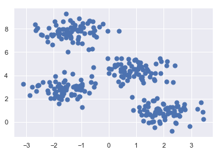
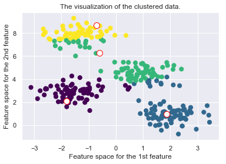
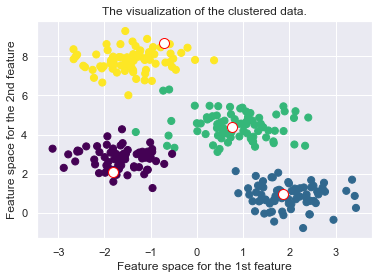
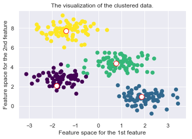
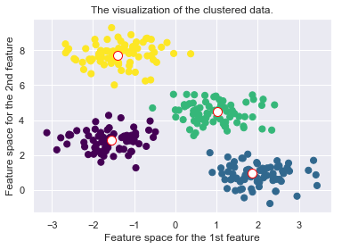

# MindNote - Machine Learning - Unsupervised Learning - Clustering

**Author: Christian M.M. Frey**  
**E-Mail: <frey@dbs.ifi.lmu.de>**

---

## K-Medoid
---

One potential problems of the K-Means algorithm is that an artificially defined centroid object might not make sense (e.g. if we think of categorial attributes). Another problem might be that there is only a distance function available but no explicit attribute-based data representation. 

The KMeans algorithm is highly sensitive to outliers since an object with an extremely large value may substatntially distort the distribution of the data. Instead of taking the mean value of the objects in a cluster as a reference point, a Medoid can be used, which is the most centrally located object in a cluster. Hence, the partitioning can still be performed based on the principle of minimizing the sum of the dissimilarities between each object and its corresponding reference point (here: medoid - kmeans: geometrical centroid)

### Partitioning Around Medoids (PAM):
The idea for the K-Medoid initialization is as follows:
* i) Select $k$ objects arbitrarily as initial medoids. These objects will be the representatives of the clusters (not as in k-means, where centroids are artifically created. These are no actual points in the dataset)
* ii) Assign each remaining (non-medoid) object to the cluster with the nearest representative
* iii) Compute the current total distance

Then the algorithm proceeds until a termination criteria is fullfilled. Let $\mathcal{M}$ be the set of Medoids and $X \setminus \mathcal{M}$ the set of non-Medoids. In the iterative process, we first identify for each pair $m \in \mathcal{M}$ and $n \in X \setminus \mathcal{M}$ (non-medoid) the total distance (= total cost) by swapping a medoid $m$ with a non-medoid $n$ object. We then choose the pair with the minimal cost and replace $m$ by $n$. If no further pair can be identified which will reduce our total costs, the algorithm terminates.

#### Load dependencies


```python
%matplotlib inline
import matplotlib.pyplot as plt
import seaborn as sns;
import numpy as np
sns.set()
from sklearn.metrics import silhouette_samples, silhouette_score
```

#### Generate dataset


```python
from sklearn.datasets.samples_generator import make_blobs
X, y_true = make_blobs(n_samples=300, centers=4, cluster_std=0.60, random_state=0)
plt.scatter(X[:, 0], X[:, 1], s=50);
```





#### Implementation of KMedoid


```python
import math
import matplotlib.cm as cm

class KMedoid (object):
    """
    Implementation of the KMedoid algorithm
    
    Arguments:
      n_clusters: number of clusters 
      medoids: the medoids describing the cluster representatives
      seed: random seed
      
    Properties: 
      n_clusters: number of clusters
      centroids: centroids being the cluster representatives
      random_gen: random number generator (for initializing the centroids)
      cls_labels: the labels of the datapoints,i.e., indicator to which cluster a point
        is affiliated
    """
    def __init__(self, n_clusters, medoids=None, seed=42):
        self.n_clusters = n_clusters
        self.medoids = medoids
        self.random_gen = np.random.RandomState(seed)
        self.cls_labels = None

    def _total_cost(self, X, m_idx):
        meds = X[m_idx, :]
        distances = np.array([np.min([self._euclidean(x, m) for m in meds]) for x in X])
        labels = np.array([np.argmin([self._euclidean(x, m) for m in meds]) for x in X])
        return np.sum(distances), labels
        
    def _euclidean (self, x, y):
        """
        calculates the l2 distance between two vectors
        
        Returns: 
          the l2 distance (euclidean distance)        
        """
        return math.sqrt(sum([(a - b) ** 2 for a, b in zip(x, y)]))

    def _pick_random_medoids(self, X):
        """
        method for initializing random medoids. Picks n random points out of the dataset,
        where n is the number of clusters
        
        Returns:
          n number of centroids, where n is the number of clusters 
        """  
        self.medoids_idx = self.random_gen.choice(X.shape[0], self.n_clusters, replace=False)
        return X[self.medoids_idx, :]
    
    def _plot_clustering(self, X, it): 
        """
        Method for plotting the current clustering. We plot the dataset, the current
        medoids and colors indicate the cluster affiliation
        
        Arguments:
          X: the dataset the algorithm is performed on
          it: the current iteration number 
            (can be used e.g. as an additional information in the title)
        """ 
        plt.figure()
        plt.title("Iteration {d}".format(d=it))
        plt.scatter(X[:, 0], X[:, 1], c=self.cls_labels, s=50, cmap='viridis');
        plt.scatter(self.medoids[:, 0], self.medoids[:, 1], s=100, c='w', edgecolor="red")
        plt.title("The visualization of the clustered data.")
        plt.xlabel("Feature space for the 1st feature")
        plt.ylabel("Feature space for the 2nd feature")
    
    def fit(self, X, max_iteration=100):
        """
        Method used for executing the KMedoid algorithm. 
        
        Arguments: 
          X: the dataset
          max_iteration: the maximal number of iterations being performed
        """    
        self.medoids = self._pick_random_medoids(X)
 
        cost, labels = self._total_cost(X, self.medoids_idx)
        self.cls_labels = labels
        best_ = self.medoids_idx
        c_cost = cost
        it = 1
        while True:
            for i in range(0, len(self.medoids_idx)):
                items_idx = np.where(self.cls_labels==i)
                for item_idx in items_idx[0]:
                    medoids_idx_test = self.medoids_idx.copy()
                    medoids_idx_test[i] = item_idx
                    tmp_cost, c_labels = self._total_cost(X, medoids_idx_test)
                    if tmp_cost < c_cost:
                        best = medoids_idx_test
                        c_cost = tmp_cost
                        best_labels = c_labels

            self._plot_clustering(X, it)
            
            if np.all(best == self.medoids_idx):
                break
            
            if c_cost < cost:
                cost = c_cost
                self.medoids_idx = best
                self.medoids = X[self.medoids_idx,:]
                self.cls_labels= best_labels
                
            it += 1
```

#### Run it!


```python
kmedoid = KMedoid(n_clusters=4)
kmedoid.fit(X)
```














#### Drawbacks of the K-Medoid Algorithm:

* High complexity of each iteration O(k(n-k)^2). We have to find the distance between each of the (n-k) data points $k$ times to place the data points in their closest cluster. After that, we need to swap each of the previously assumed medoids with each non-medoids and recompute the distance between (n-k) objects. Hence, k-Medoids is more costly than the k-Means method
* Not suitable for clustering non-spherical groups of objects. 
* the hyperparameter $k$ has to be set beforehand, i.e., the algorithm cannot identify the number of clusters by itself 
* may obtain different results for different runs on the  same dataset because the first $k$ medoids are chosen randomly

# End of this MindNote
