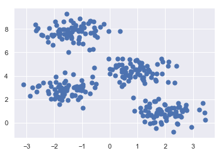
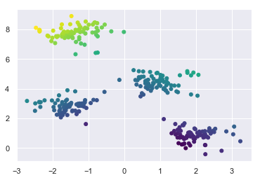
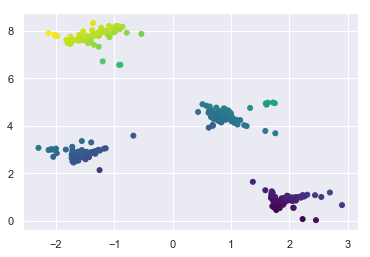
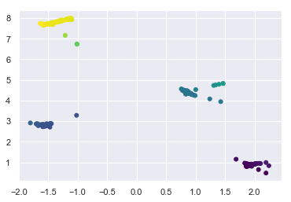
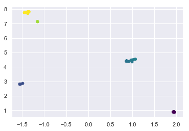
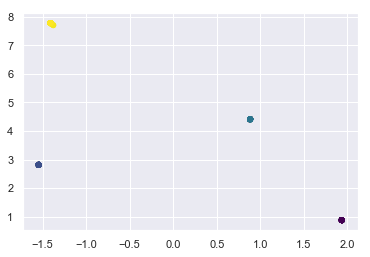
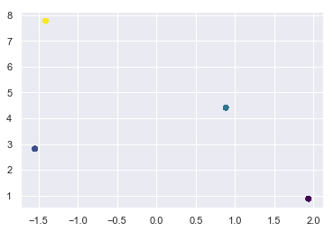

# MindNote - Machine Learning - Unsupervised Learning - Clustering

**Author: Christian M.M. Frey**  
**E-Mail: <frey@dbs.ifi.lmu.de>**

---

## Mean Shift
---

### Recap on Kernel Density Estimation 

The 1D kernel density estimation (KDE) model uses 
$$
p (x^i) = \frac{1}{n} \sum_{j=1}^{n} k_\sigma (x^i-x^j)
$$

where the PDF $k$ is the kernel and the parameter $\sigma$ is the bandwidth.

When using the (normlized) gaussian kernel

$$
k_1(r) = \frac{1}{\sqrt{2 \pi}} exp(- \frac{r^2}{2})
$$

Note that we can add a bandwidth (standard deviation) $\sigma$ to any PDF $k_1$, using

$$
k_\sigma (r) = \frac{1}{\sigma} k_1 (\frac{r}{\sigma})
$$
which results for the gaussian kernel in the following

$$
k_\sigma(r) = \frac{1}{\sigma \sqrt{2 \pi}} exp (- \frac{r^2}{2 \sigma^2})
$$

### Mean Shift procedure
The steps of the mean shift algorithm are as follows:
* For each data point x in our dataset D, we calculate the distance between x and every other point in D
* Calculate weights for each point in D by using a kernel (here we will use a gaussian kernel) of that point's distance to x
* * The kernel function penalizes points with increasing distance
* * The rate at which the weights converge to zero is determined by the bandwidth (see above)
* Next, we update x as the weighted average of all other points in D

-> Following this procedure, the algorithm pushes points that are close together even closer until they reach a termination criterion. 

#### Load dependencies


```python
%matplotlib inline
import matplotlib.pyplot as plt
import seaborn as sns;
import numpy as np
from numpy import exp, sqrt, array, abs
sns.set()
import math
import matplotlib.cm as cm
```

#### Generate Data


```python
from sklearn.datasets.samples_generator import make_blobs
X, y_true = make_blobs(n_samples=300, centers=4, cluster_std=0.60, random_state=0)
plt.scatter(X[:, 0], X[:, 1], s=50);
```





#### Implementation of MeanShift with gaussian kernel


```python
class MeanShift(object):
    '''
    Implementation of the MeanShift algorithm with a gaussian kernel
    
    Arguments: 
      max_iter: maximal number of iterations
      bandwidth: standard deviation of the gaussian kernel
      tol: tolerance threshold
      
    Properties:
      max_iter: maximal number of iterations
      bandwidth: standard deviation of the gaussian kernel
      tol: tolerance threshold
    '''
    
    def __init__(self, max_iter=100, bandwidth=.5, tol=1e-5):
        self.max_iter = max_iter
        self.bandwidth = bandwidth
        self.tol = tol
    
    def distance(self, x, X):
        '''
        Calculates the euclidean distance between a datapoint x to all other points in the dataset, denoted as X
        
        Arguments: 
          x: datapoint to which the distances will be calculated
          X: the dataset including all datapoints
        '''
        return (sqrt((x-X)**2).sum(1))
    
    def gaussian_kernel(self, d, bandwidth):
        '''
        Defines the gaussian kernel
        
        Arguments:
          d: distance 
          bandwidth: bandwidth defining the standard deviation of the gaussian kernel
        '''
        f_1 = 1.0/(bandwidth * math.sqrt(2*math.pi))
        f_2 = exp(-0.5*((d/bandwidth))**2)
        return f_1 * f_2 
    
    def _calc (self, x, X, bandwidth):
        '''
        calcuates the weighted average of all datapoints in X w.r.t to a certain datapoint x in X.
        
        Arguments:
          x: datapoint being currently considered
          X: dataset
          bandwidth: bandwidth for the gaussian kernel (smoothing factor)
        '''
        dist = self.distance(x, X)
        weight = self.gaussian_kernel(dist, bandwidth)
        return (weight[:, None]*X).sum(0) / weight.sum()
    
    def _plot (self, X):
        '''
        simple plotting
        '''
        dist = self.distance([0,0], X)
        plt.figure()
        plt.scatter(X[:,0], X[:, 1], s=25, c=dist, cmap='viridis')
        
    def fit (self, X):
        '''
        Executes the MeanShift algorithm. 
        
        Arguments: 
          X: dataset
        '''
        it = 0
        for i in range(self.max_iter):
            X_adapted = np.array([self._calc(x,X,self.bandwidth) for x in X])
            if it % 1 == 0:
                self._plot(X_adapted)
            if it >= self.max_iter or abs(X-X_adapted).sum()/abs(X.sum()) < self.tol:
                print ("Convergence at iteration {}".format(it))
                return X_adapted
            X = X_adapted
            it += 1
```

#### Run it


```python
meanshift = MeanShift()
meanshift.fit(X);
```

    Convergence at iteration 6




















#### Advantages of MeanShift
* Clusters can have arbitrary shape and size and there are no restriction to convex shapes
* Number of clusters is determined autormatically
* Robustness against outliers
* Easy implementation and parallelisation
* Choice of kernel function

#### Additional notes
* published in: Dorin Comaniciu and Peter Meer. 2002. Mean Shift: A Robust Approach Toward Feature Space Analysis. IEEE Trans. Pattern Anal. Mach. Intell. 24, 5 (May 2002), 603-619. DOI=http://dx.doi.org/10.1109/34.1000236

# End of this MindNote
