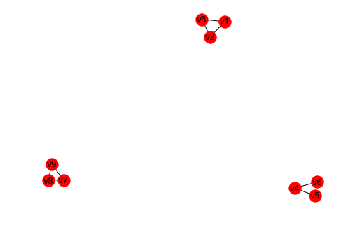
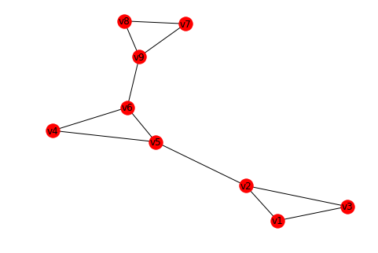
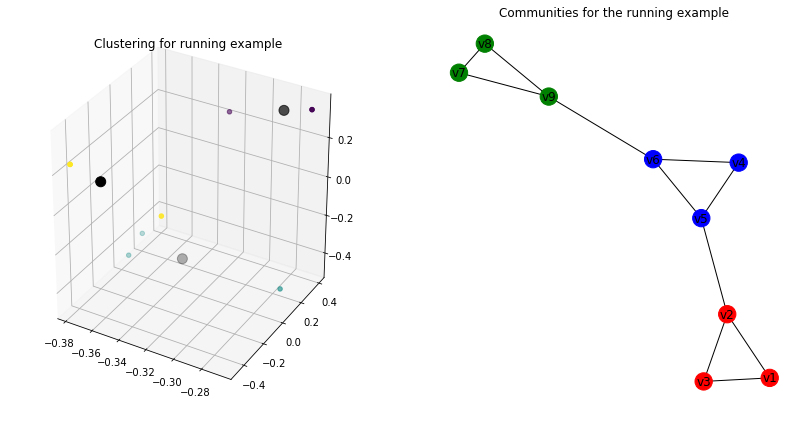
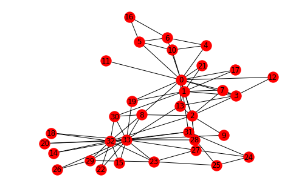
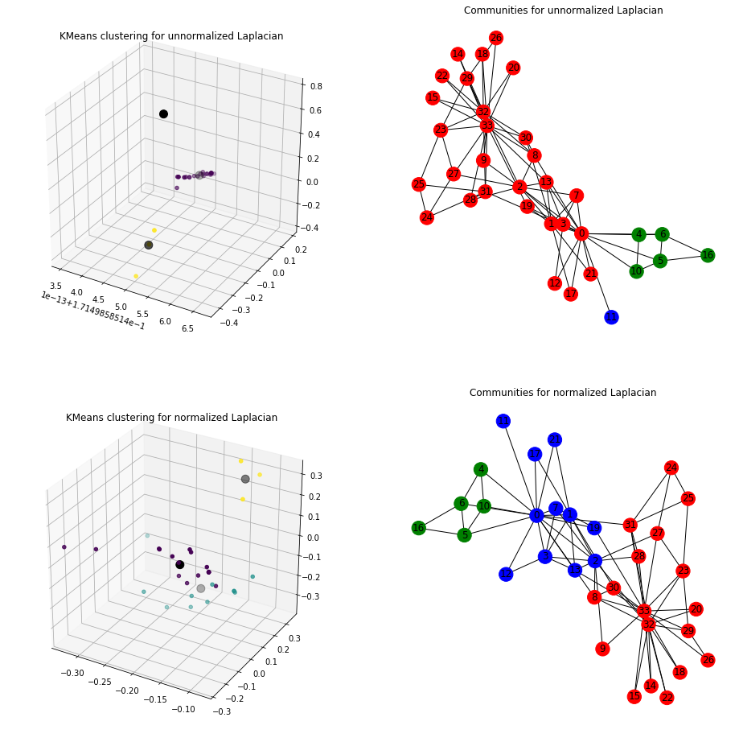
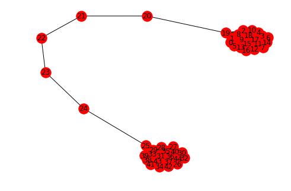
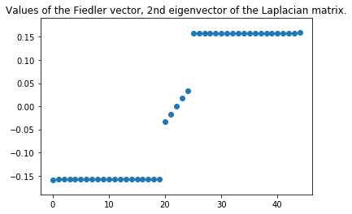

# MindNote - Machine Learning - Unsupervised Learning - Clustering

**Author: Christian M.M. Frey**  
**E-Mail: <frey@dbs.ifi.lmu.de>**

---

# Spectral Clustering
---

### General graph notation

Let $G=(V,E)$ be an undirected graph with vertex set V$ = \{v_1, \ldots, v_n\}$. Furthermore, each edge $e_{ij}$ has a non-negative weight $w_{ij} \geq 0$. The weighted adjacency matrix of a graph is the matrix $W = (w_{ij})\_{i,k=1}^n$. If two vertices are not connected, the weight equals 0. In the following we will focus on undirected graphs, i.e., $w_{ij} = w_{ji}$. The <b>degree of a vertex</b> $v_i \in V$ is defined as the sum of its incident edges: 
$$
d_i = \sum_{j=1}^{n} w_{ij}
$$

We can express the <b>degree matrix D</b> as a diagonal matrix with the degrees $d_1, \ldots, d_n$ for all vertices $v_1, \ldots, v_n$ on the diagonal. 
The size of a subset $A \subset V$ can be measured in two ways:
* $\|A\| :=$ cardinality of the subset indicating the number of nodes in A
* $vol(A) := \sum_{i \in A} d_i$ ; size of A is measured by the weights of edges in A

By defining an indicator vector $\mathbb{1}_A = (f_1, \ldots, f_n)' \in \mathbb{R}^n$ we can define the affiliation of vertices to the subset A, i.e., $f_i=1$ if $v_i \in A$ and $f_i=0$ otherwise.

### Graph Laplacians 
Spectral clustering in the scope of graphs are based on the analysis of graph Laplacian matrices. Spectral graph theory is the main research field concentrating on that analysis. Here, we will just have a short recap on the definition of graph Laplacians and point out their most important properties. 

#### The unnormalized graph Laplacian
The unnormalized graph Lapalcian matrix is defined as 
$$
L = D - W
$$

For spectral clustering we additionally need the following propositions:

<b>Proposition 1 (Properties of L)</b> .
* 1) For every vector $f \in \mathbb{R}^n$, we have
$$
f' L f = \frac{1}{2} \sum_{i,j}^n w_{ij} (f_i - f_j)^2
$$
* 2) L is symmetric and positive semi-definite
* 3) The smallest eigenvalue of L is 0, the corresponding eigenvector is the constant one vector $\mathbb{1}$
* 4) L has $n$ non-negative, real-values eigenvalues $0 = \lambda_1 \leq \ldots \leq \lambda_n$

Proof of 2. The symmetry of L follows directly from the symmetry of $W$ and $D$. The positive semi-definiteness is a direct consequence of (1) showing $f' L f \geq 0, \forall f \in \mathbb{R}^n$.

<b>Proposition 2 (Number of connected components).</b>
Let $G$ be an undirected graph with non-negative weights. Then, the multiplicity $k$ of the eigenvalue $0$ of $L$ equals the number of connected components $A_1, \ldots, A_k$ in the graph. The eigenspace of eigenvalue $0$ is spanned by the indicator vectors $\mathbb{1}_{A_1}, \ldots, \mathbb{1}_{A_k}$ of those components.

Proof. We start with the case $k=1$, that is the graph is connected. Assume that $f$ is an eigenvector with eigenvalue $0$. The we know that 
$$
0 = f' L f = \sum_{i,j =1}^n w_{ij} (f_i - f_j)^2
$$
By definition the weights $w_{ij}$ are non-negative. Hence, the sum can only be $0$ iff all terms $(f_i - f_j)^2$ vanish. If two vertices $v_i$ and $v_j$ are connected, then $f_i$ is equal to $f_j$. Consequently, $f$ needs to be constant on the whole connected component. If the graph is connected, we thus only have the constant one vector $\mathbb{1}$ as eigenvector with eigenvalue $0$, which obviously is the indicator vector of the connected component.

Next, let's consider the case of $k$ connected components. W.l.o.g. we assume that the vertices are ordered according to the connected components they belong to. In this case, $W$ has a block diagonal form, and so does $L$. 
$$
  L =
  \begin{bmatrix}
    L_{1} & & \\
    & \ddots & \\
    & & L_{k}
  \end{bmatrix}
$$
Each of the blocks $L_i$ is a proper graph Laplacian on its own, namely the Laplacian corresponding to the subgraph of the $i$-th connected component. As it is the case for all block diagonal matrices, we know that the spectrum of $L$ is given by the union of the spectra of $L_i$, and the corresponding eigenvectors of $L$ are the eigenvectors of $L_i$, filled with $0$ at the positions of the other blocks. As each $L_i$ is a graph Laplacian of a connected graph, we know that every $L_i$ has eigenvalue $0$ with multiplicity $1$, and the corresponding eigenvector is the constant one vector on the $i$-th connected component. Thus, the matrix $L$ has as many eigenvalues $0$ as there are connected components, and the corresponding eigenvectors are the indicator vectors of the connected components. 

#### Example 1.

#### Load dependencies


```python
import numpy as np
import matplotlib.pyplot as plt
from mpl_toolkits.mplot3d import Axes3D
%matplotlib inline
from numpy import linalg as LA
from sklearn.cluster import KMeans
import networkx as nx
```


```python
# Construct a graph with 3 connected components
G = nx.Graph()

G.add_edge('v1', 'v2', weight=1)
G.add_edge('v1', 'v3', weight=1)
G.add_edge('v2', 'v3', weight=1)

# G.add_edge('v2', 'v5', weight=1)

G.add_edge('v5', 'v4', weight=1)
G.add_edge('v5', 'v6', weight=2)
G.add_edge('v4', 'v6', weight=1)

# G.add_edge('v6', 'v9', weight=1)

G.add_edge('v9', 'v7', weight=1)
G.add_edge('v9', 'v8', weight=1)
G.add_edge('v7', 'v8', weight=3)

nx.draw_spring(G, with_labels=True)
```





#### Compute the unnormalized Laplacian matrix


```python
laplacian_ = nx.laplacian_matrix(G, weight='weight')
laplacian_.todense()
```


    matrix([[ 2, -1, -1,  0,  0,  0,  0,  0,  0],
            [-1,  2, -1,  0,  0,  0,  0,  0,  0],
            [-1, -1,  2,  0,  0,  0,  0,  0,  0],
            [ 0,  0,  0,  3, -1, -2,  0,  0,  0],
            [ 0,  0,  0, -1,  2, -1,  0,  0,  0],
            [ 0,  0,  0, -2, -1,  3,  0,  0,  0],
            [ 0,  0,  0,  0,  0,  0,  2, -1, -1],
            [ 0,  0,  0,  0,  0,  0, -1,  4, -3],
            [ 0,  0,  0,  0,  0,  0, -1, -3,  4]], dtype=int64)


#### Compute the eigenvalues and eigenvectors 


```python
eigenvals_, eigenvecs_ = LA.eigh(laplacian_.todense())
# print the first eigenvalues and eigenvectors
print (eigenvals_[:3])
print (eigenvecs_[:, :3])
```

    [-5.55111512e-16  2.22044605e-16  5.89805982e-16]
    [[0.         0.57735027 0.        ]
     [0.         0.57735027 0.        ]
     [0.         0.57735027 0.        ]
     [0.         0.         0.57735027]
     [0.         0.         0.57735027]
     [0.         0.         0.57735027]
     [0.57735027 0.         0.        ]
     [0.57735027 0.         0.        ]
     [0.57735027 0.         0.        ]]


Hence, we can see the multiplicity of the eigenvalue $0$ of $L$. Furthermore, we can read the indicator functions of the connected components. Note that by scaling them to $1$ does not change the characteristic of the graph setting.

#### The normalized graph Laplacians 

There are two matrices which are called normalized graph Laplacians in the literature. Both matrices are closely related to each other and are defined as:

$$
L_{sym} = D^{-1/2} L D^{-1/2} = I - D^{-1/2} W D^{-1/2}
$$
$$
L_{rw} = D^{-1} L = I - D^{-1}W.
$$
We denote the first matrix by $L_{sym}$ as it is a symmetric matrix, and the second one by $L_{rw}$ as it is cloesly ocnnected to a random walk. 

Let's summarize the propositions of $L_{sym}$, resp., $L_{rw}$:

<b>Proposition 3 (Properties of $L_{sym}$ and $L_{rw})$</b>.
The normalized Laplacians satisfy the following properties:
* 1) For every $f \in \mathbb{R}^n$ we have
$$
f' L_{sym} f = \frac{1}{2} \sum_{i,j=1}^{n} w_{ij} (\frac{f_i}{\sqrt{d_i}} - \frac{f_j}{\sqrt{d_j}})^2
$$
* 2) $\lambda$ is an eigenvalue of $L_{rw}$ with eigenvector $v$ iff $\lambda$ is an eigenvalue of $L_{sym}$ with eigenvector $w=D^{1/2}v$
* 3) $\lambda$ is an eigenvalue of $L_{rw}$ with eigenvector $v$ iff $\lambda$ and $v$ solve the generalized eigenproblem $Lv = \lambda D v$.
* 4) $0$ is an eigenvalue of $L_{rw}$ with the constant one vector $\mathbb{1}$ as eigenvector. $0$ is an eigenvalue of $L_{sym}$ with eigenvector $D^{1/2} \mathbb{1}$
* 5) L_{sym} and $L_{rw}$ are positive semi-definite and have $n$ non-negative real-values eigenvalues $0 = \lambda_1 \leq \ldots \lambda_n$

And again, we can state a proposition for the number of connected components of the graph by inspecting the multiplicity of the eigenvalue $0$.

<b>Proposition 4 (Number of connected components):</b>
Let $G$ be an undirected graph with non-negative weights. Then the mutiplicity $k$ of the eigenvalue $0$ of both $L_{rw}$ and $L_{sym}$ equals the number of connected components $A_1, \ldots, A_k$ in the grpah. For $L_{rw}$, the eigenspace of $0$ is spanned by the indicate vectors $\mathbb{1}_{A_i}$ of those components. 

### Spectral clustering procedures
Now, we will have a look at the basic procedure for spectral clustering. It is assumed that we are given data points $x_1, \ldots, x_n$ which can be arbitrary objects, and their similarities $s_{ij} = s(x_i, x_j)$, measured according to some similarity function which is symmetric and non-negative. We denote the corresponding similarity matrix by $S = (s_{ij})_{i,j=1}^n$

Unnormalized spectral clustering:
```python
Input: Similarity matrix S, number of k clusters to construct
1. Construct a similarity graph. Let W be its weighted adjacency matrix
2. Compute the unnormalized Laplacian L
3. Compute the first k eigenvectors v_1, ..., v_k of L
4. Let V be the matrix containing the vectors v_1, ..., v_k as cols
5. For i = 1, ...,n, let y_i in R^k be the vector corresponding to the i-th row of V
6. Cluster the points (y_i)_i=1,...,n in R^k with the kmeans algorithm into clusters C_1, ..., C_k
Output: Clusters A_1, ...., A_k with A_i={j | y_j in C_i}
```

#### Constructing a artificial graph


```python
class SpectralClustering(object):
    
    def __init__(self, method='Lap'):
        self.method = method
        self.clustering = None
        self.eigenvals = None
        self.eigenvecs = None
        self.G = None
        
    def _get_laplacian (self, normalized=True):
        if normalized:
            laplacian_ = nx.normalized_laplacian_matrix(self.G, weight="weight")
        else:
            laplacian_ = nx.laplacian_matrix(self.G, weight='weight')
        return laplacian_.todense()
    
    def _calc_kmeans(self, n_cluster=3, n_vecs=3):
        kmeans = KMeans(n_clusters=n_cluster)
        kmeans.fit(self.eigenvecs[:, :n_vecs])
        return kmeans
    
    def _plot3D_clustering(self, ax, title=""):
        ax.scatter(
            np.ravel(self.eigenvecs[:, 0]), 
            np.ravel(self.eigenvecs[:, 1]), 
            np.ravel(self.eigenvecs[:, 2]), 
            c=self.clustering.labels_, 
            cmap='viridis')
        ax.scatter(
            self.clustering.cluster_centers_[:, 0], 
            self.clustering.cluster_centers_[:, 1], 
            self.clustering.cluster_centers_[:, 2], 
            c="k", 
            s=100)
        ax.set_title(title)
        
    def _plot_graph_components(self, ax, title=""):
        color_dic = {0: 'r', 1: 'b', 2:'g', 3:'y', 4:"c", 5:"m"}
        color_map = [color_dic[l] for l in self.clustering.labels_]
        ax.set_title(title)
        nx.draw_spring(self.G, with_labels=True, node_color=color_map)
            
    def fit(self, G, normalized=True):
        self.G = G
        laplacian = self._get_laplacian(normalized)
        self.eigenvals, self.eigenvecs = LA.eigh(laplacian)
        self.clustering = self._calc_kmeans(n_cluster=3, n_vecs=3)
```

#### Running example


```python
G = nx.Graph()

G.add_edge('v1', 'v2', weight=1)
G.add_edge('v1', 'v3', weight=1)
G.add_edge('v2', 'v3', weight=1)

G.add_edge('v2', 'v5', weight=1)

G.add_edge('v5', 'v4', weight=1)
G.add_edge('v5', 'v6', weight=2)
G.add_edge('v4', 'v6', weight=1)

G.add_edge('v6', 'v9', weight=1)

G.add_edge('v9', 'v7', weight=1)
G.add_edge('v9', 'v8', weight=1)
G.add_edge('v7', 'v8', weight=3)

nx.draw_spring(G, with_labels=True)
```





#### Fit running example


```python
sc = SpectralClustering()
sc.fit(G)
```


```python
fig = plt.figure(figsize=(14,7))
ax1 = fig.add_subplot(121, projection='3d')
sc._plot3D_clustering(ax1, "Clustering for running example")

ax2 = fig.add_subplot(122)
sc._plot_graph_components(ax2, "Communities for the running example")
```





#### Karate Club Graph


```python
# Load graph
G = nx.karate_club_graph()
nx.draw_spring(G, with_labels=True)
```





```python
# Fit model - unnormalized
sc = SpectralClustering()
sc.fit(G, normalized = False)
# plot kmeans
fig = plt.figure(figsize=(16,16))
ax1= fig.add_subplot(221, projection='3d')
sc._plot3D_clustering(ax1, title="KMeans clustering for unnormalized Laplacian")
# plot communities within the graph
ax2 = fig.add_subplot(222)
plt.subplot(222)
sc._plot_graph_components(ax2, 'Communities for unnormalized Laplacian')


# Fit model - normalized
sc.fit(G, normalized = True)
# plot kmeans
ax3 = fig.add_subplot(223, projection='3d')
sc._plot3D_clustering(ax3, title="KMeans clustering for normalized Laplacian")
# plot communities within the graph
ax4 = fig.add_subplot(224)
plt.subplot(224)
sc._plot_graph_components(ax4, 'Communities for normalized Laplacian')
```





Unnormalized Laplacian serve in the approximation of the minimization of RatioCut, while normalized Laplacian serve in the approximation of the minimization of NCut.

#### Upcoming topic - Fiedler vector

In some applications it might be desirable to divide a given connected graph G into two subgraphs such that the number of edges having one end vertex in each of the twosubgraphs. One method uses the Fiedler vector. It again involces the Laplacian matrix of G and it subdivides G intwo two subgraphs by using one of the eigenvectors of the Laplacian matrix.

Using the sign of the values in the Fiedler vector can be used as a tool of determining which subgraph to place the vertices in.


```python
g = nx.barbell_graph(20, 5)
nx.draw_spring(g, with_labels=True)
lap = nx.normalized_laplacian_matrix(g).todense()
w,v = LA.eigh(lap)
plt.figure()
plt.title("Values of the Fiedler vector, 2nd eigenvector of the Laplacian matrix.")
plt.scatter(range(len(v[:,1])), sorted(np.ravel(v[:,1])))
```


    <matplotlib.collections.PathCollection at 0x1a159e7198>








#### Additional notes:
* Great tutorial on spectral clustering: Ulrike von Luxburg - A Tutorial on Spectral Clustering, 2006

# End of this Mindnote
